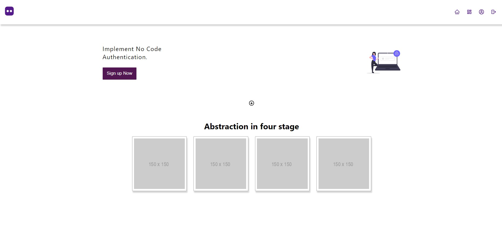

[Getting Started with Create React App](https://github.com/ZiaCodes/Authy/blob/patch-1/Getting%20Started%20with%20Create%20React%20App.md)

------
### How to Contribute to this repository

* Fork the repository (Click the Fork button in the top right of this page, click your Profile Image)
* Clone the forked repository to your local machine.
```markdown
git clone https://github.com/ZiaCodes/Authy.git
```
* change the present working directory
```markdown
cd Authy
```
* Add/Create your project to the specific folder as described in what you can contribute section.
* Make a new branch
```markdown
git checkout -b branch-name
```
* Make change in the repository with the new branch.
* push the changes.
```markdown
git add .
git commit -m "Your commit Message"
git push origin branch-name
```
* Make a pull request.
